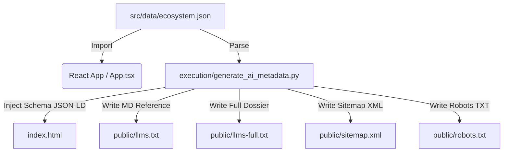

# SOP - AI and GEO Metadata Synchronization

This Standard Operating Procedure (SOP) outlines how to manage, maintain, and synchronize SEO, GEO (Generative Engine Optimization), and AI-indexing files for the `bervos.org` ecosystem.

---

## 1. Core Architecture Overview

We use a single source of truth for all project descriptions and metadata to ensure consistency across the React application, HTML search engines, and AI scrapers.



---

## 2. Trigger Events

You **MUST** run the synchronization workflow whenever:
1. A new project is added to the Bervos ecosystem.
2. A project's description, tags, logo, or URL changes.
3. An open-source package is added or updated.
4. The owner or organization information changes.
5. Preparing a release or deploying the codebase.

---

## 3. Step-by-Step Execution Workflow

### Step 1: Update the Source Data
Modify `src/data/ecosystem.json` with the new information. Ensure all fields are fully populated (e.g., tags, category, link).

### Step 2: Run the Execution Script
From the project root directory, run the Python utility script:
```bash
python3 execution/generate_ai_metadata.py
```

### Step 3: Verify the Changes
Check that the following files have been modified/generated with current timestamps and content:
- `index.html` (the `<script type="application/ld+json" id="schema-jsonld">` block contains the correct values).
- `public/llms.txt` (a clean Markdown overview).
- `public/llms-full.txt` (the complete dossier).
- `public/robots.txt` (lists sitemaps and references).
- `public/sitemap.xml` (contains sitemap tags for the home and LLM files).

### Step 4: Run compilation / Dev checks
Verify the project compiles correctly and has no TS errors:
```bash
npm run build
```
